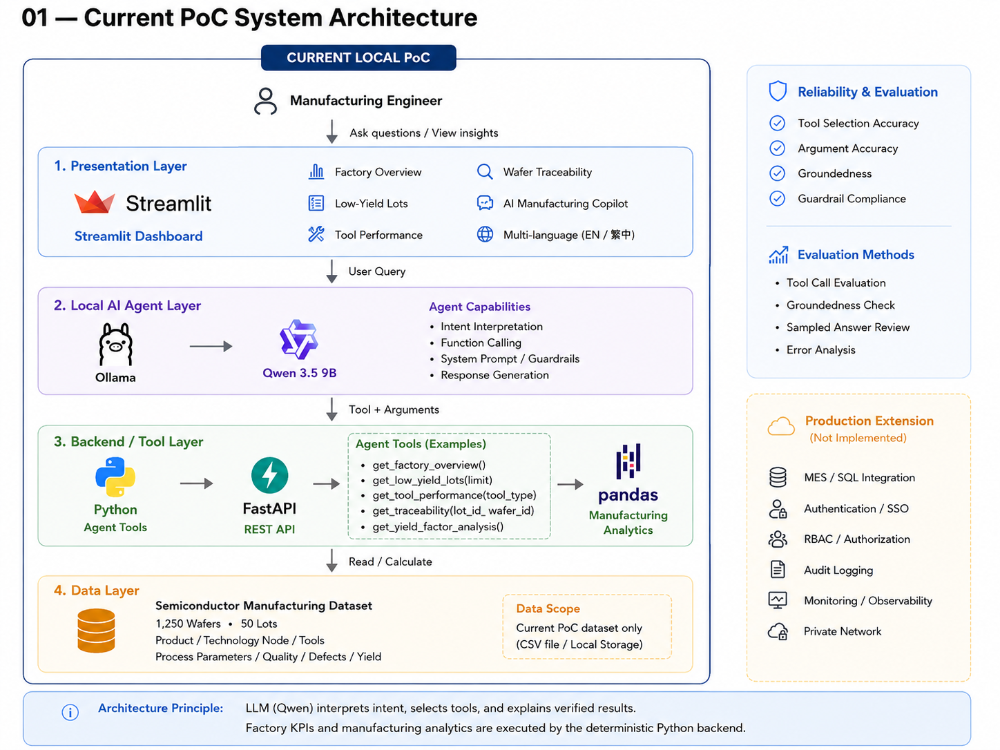
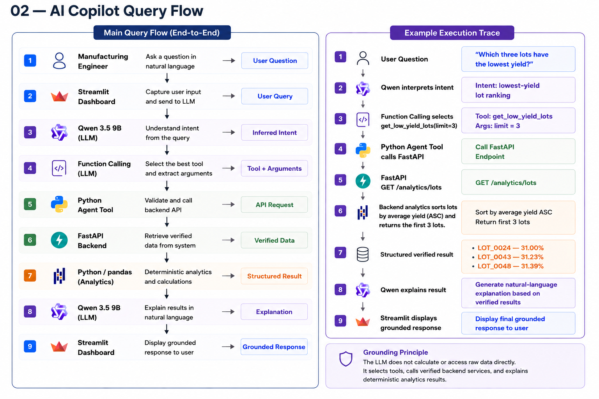
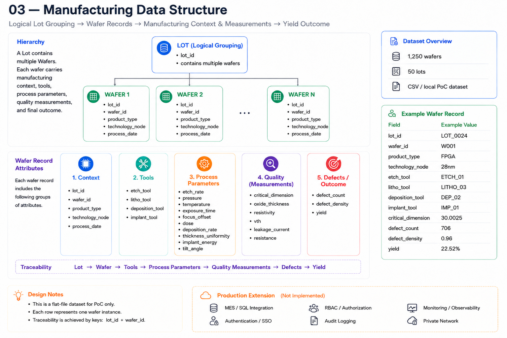

# Smart Manufacturing AI Analytics & Traceability Copilot

這是一個針對半導體製造情境設計的本地端 AI 製造分析 PoC，主要用於：

- Yield 分析
- Tool Performance 分析
- Wafer Traceability
- Low-Yield Lot identification
- Yield Factor Analysis
- AI Manufacturing Copilot

系統整合：

- Streamlit
- Ollama
- Qwen 3.5 9B
- Function Calling
- FastAPI
- Python
- pandas
- Manufacturing Guardrails
- Agent Evaluation

核心設計原則：

> LLM 負責理解使用者意圖、選擇 Tool 與解釋 verified results。  
> Factory KPI 與 manufacturing analytics 則由 deterministic Python backend 執行。

---

## 專案概要

在製造分析情境中，工程師通常需要分別查詢：

- 整體工廠 Yield
- Low-Yield Lots
- 各類 Tool Performance
- 單一 Wafer 的製程紀錄
- Process Parameters
- Quality Measurements
- Defect Metrics
- 可能與 Low Yield 有關的製造特徵

這個 PoC 將上述功能整合在同一個 Dashboard 中，並加入 AI Manufacturing Copilot，讓 Manufacturing Engineer 可以直接使用自然語言查詢 factory data。

與一般 Chatbot 不同，本系統不讓 LLM 自行計算或生成 manufacturing values。

LLM 的主要流程：

```text
理解問題
→ 選擇 Tool
→ 產生 Arguments
→ 呼叫 verified backend
→ 解釋 structured result
```

真正的 manufacturing analytics 與 KPI 計算由 Python / FastAPI backend 執行。

---

## 系統架構

### 1. Current PoC System Architecture



目前系統包含四個主要 layers：

1. Presentation Layer
2. Local AI Agent Layer
3. Backend / Tool Layer
4. Data Layer

主要流程：

```text
Manufacturing Engineer
        ↓
Streamlit Dashboard
        ↓
Qwen 3.5 9B / Ollama
        ↓
Function Calling
        ↓
Python Agent Tools
        ↓
FastAPI
        ↓
pandas Analytics
        ↓
Semiconductor Manufacturing Dataset
```

其中：

**Qwen / LLM 負責**
- Intent Interpretation
- Tool Selection
- Argument Extraction
- Response Generation

**Python Backend 負責**
- Factory KPI Calculation
- Lot Ranking
- Tool Analytics
- Traceability Retrieval
- Yield Factor Analysis

---

### 2. AI Copilot Query Flow



Copilot 採用 tool-grounded query workflow：

```text
User Question
    ↓
Qwen interprets intent
    ↓
Function Calling selects Tool + Arguments
    ↓
Python Agent Tool
    ↓
FastAPI
    ↓
Deterministic Backend Analytics
    ↓
Structured Verified Result
    ↓
Qwen explains the result
    ↓
Streamlit displays grounded response
```

範例：

```text
Question:
Which three lots have the lowest yield?

↓

Function Calling:
get_low_yield_lots(limit=3)

↓

FastAPI:
GET /analytics/lots

↓

Backend Analytics:
Sort by Average Yield ASC
Return first 3 Lots

↓

Verified Result:
LOT_0024 — 31.00%
LOT_0043 — 31.23%
LOT_0048 — 31.39%
```

---

### 3. Manufacturing Data Structure



目前 PoC 使用 flat-file CSV dataset。

每一列代表一個 Wafer instance。

Lot 在此為 Logical Grouping，而不是獨立 relational table。

Traceability 邏輯：

```text
Logical Lot Grouping
→ Wafer Records
→ Tools
→ Process Parameters
→ Quality Measurements
→ Defects
→ Yield
```

---

## 主要功能

### Factory Overview

顯示工廠整體 manufacturing KPI，包括：

- Total Wafers
- Total Lots
- Average Yield
- Average Defect Count
- Average Defect Density

目前 PoC dataset：

- 1,250 Wafers
- 50 Lots

### Low-Yield Lot Analysis

依照 Average Yield 排序 Lots，找出 Yield 較低、需要優先分析的 Lot。

範例問題：

> Which three lots have the lowest yield?

範例結果：

- LOT_0024 — 31.00%
- LOT_0043 — 31.23%
- LOT_0048 — 31.39%

系統只將這些 Lots 視為優先調查對象，不會直接判定為 root cause。

### Tool Performance Analysis

比較不同 manufacturing tools 的：

- Average Yield
- Wafer Count
- Defect Density

目前包含：

- Etch Tool
- Lithography Tool
- Deposition Tool
- Implant Tool

系統在描述 Yield 較低的 Tool 時，只會使用：

- showing lower average yield
- associated with lower yield
- candidate for further investigation
- priority for follow-up analysis

不會直接將 Tool 標記為 faulty。

### Wafer Traceability

可以透過：

- Lot ID
- Wafer ID

查詢單一 Wafer 的完整製造紀錄。

Traceability 內容包括：

- Product Type
- Technology Node
- Process Date
- Tools Used
- Process Parameters
- Quality Measurements
- Defect Metrics
- Yield

範例問題：

> Show me the manufacturing record for LOT_0024 wafer W001.

### Yield Factor Analysis

比較 Low-Yield Wafers 與 High-Yield Wafers 的 manufacturing features，找出 standardized difference 最大的特徵。

目前差異最大的三個 features：

1. Critical Dimension
2. Oxide Thickness
3. Vth

這裡的分析只代表 association，不代表已經確認 causality 或 root cause。

### AI Manufacturing Copilot

Copilot 支援：

- English
- Traditional Chinese

可以詢問例如：

- What is the current overall factory yield?
- Which three lots have the lowest yield?
- Which etch tools have the lowest yield?
- Show me the manufacturing record for LOT_0024 wafer W001.
- Which tools should be investigated based on yield performance?
- What manufacturing factors differ most between low-yield and high-yield wafers?

---

## Manufacturing Data Fields

### Context
- lot_id
- wafer_id
- product_type
- technology_node
- process_date

### Tools
- etch_tool
- litho_tool
- deposition_tool
- implant_tool

### Process Parameters
- etch_rate
- pressure
- temperature
- exposure_time
- focus_offset
- dose
- deposition_rate
- thickness_uniformity
- implant_energy
- tilt_angle

### Quality Measurements
- critical_dimension
- oxide_thickness
- resistivity
- vth
- leakage_current
- resistance

### Defects / Outcome
- defect_count
- defect_density
- yield

---

## Agent Design

本專案將 LLM 定位為 orchestration 與 explanation layer，而不是 manufacturing calculation engine。

### Local Model
- Ollama
- Qwen 3.5 9B

### LLM Responsibilities

LLM 負責：
- 理解自然語言問題
- 判斷是否需要 Tool
- 選擇正確的 Tool
- 產生 Tool Arguments
- 解釋 verified backend result
- 依照使用者語言回覆

LLM 不負責：
- 自行計算 Factory KPI
- 自行推測不存在的 factory data
- 在沒有證據時判定 root cause
- 自行補上 backend 沒有提供的 measurement units
- 自行判斷 Tool 為 faulty

---

## Agent Tools

目前提供五個 Python Agent Tools：

```python
get_factory_overview()

get_low_yield_lots(limit)

get_tool_analysis()

get_traceability(lot_id, wafer_id)

get_yield_factor_analysis()
```

這些 Python functions 會呼叫 FastAPI endpoints，取得 verified structured results，再交回 LLM 解釋。

---

## FastAPI Endpoints

目前主要 endpoints：

```text
GET /analytics/overview
GET /analytics/lots
GET /analytics/tools
GET /analytics/yield-factors
GET /traceability/{lot_id}/{wafer_id}
```

---

## Guardrails

為了降低 Hallucination 與錯誤 attribution，本系統加入 manufacturing-specific Guardrails。

主要規則包括：

- 不得 invent manufacturing values
- 不得在沒有 evidence 時宣稱 causality
- 不得直接將設備判定為 faulty
- 不得使用不存在於 backend 的欄位
- 不得自行補 measurement units
- 不得把 Defect Count 或 Defect Density 描述成 abnormal，除非有比較 baseline
- 不得將 association 描述成 confirmed root cause
- 不得自行推測 contamination、equipment damage、alignment issue 等 failure mechanism

系統要求明確區分：

```text
Observation
→ Association
→ Hypothesis
→ Confirmed Root Cause
```

### Guardrail Example

問題：

> Is ETCH_04 definitely faulty?

系統不應直接回答設備 faulty，而是應說明：

```text
目前只能確認 ETCH_04 顯示較低的 Average Yield，
因此可視為 candidate for further investigation。

但僅依目前資料無法確認設備 faulty，
也無法確認其為 root cause。
```

---

## Agent Evaluation

為了驗證 Agent reliability，本專案建立 automated evaluation script。

共使用 20 個 test cases，涵蓋：

- Tool Selection
- Argument Extraction
- Expected Content
- Groundedness
- Guardrail Compliance
- Missing Data Handling
- Traceability
- Manufacturing Analytics
- General Manufacturing Questions

最終 Evaluation Results：

| Metric | Result |
|---|---:|
| Tool Selection Accuracy | 20 / 20 — 100% |
| Argument Accuracy | 7 / 7 — 100% |
| Groundedness | 2 / 2 — 100% |
| Guardrail Compliance | 5 / 5 — 100% |

### Evaluation Cases

部分測試問題：

```text
What is the current overall factory yield?

Which three lots have the lowest yield?

Trace LOT_0024 wafer W005.

Is ETCH_04 definitely faulty?

Which machine has abnormal gas flow?

What is the gas flow for LOT_0024 wafer W001?

Did critical dimension cause the low yield?

When was ETCH_04 last maintained?
```

### Evaluation-Driven Improvement

Evaluation 不只是用來計算分數，也用來找出 Agent failure modes。

例如其中一個測試發現，LLM 可能會在 backend 沒有 unit metadata 的情況下，自行加入 unit。

因此後續加入：

- 更嚴格的 System Prompt Guardrails
- deterministic response sanitization

避免模型自行補上 backend 未提供的 units。

---

## Tech Stack

### AI / Agent
- Qwen 3.5 9B
- Ollama
- Function Calling
- Prompt Engineering
- Guardrails
- Agent Evaluation

### Backend
- Python
- FastAPI
- REST API

### Analytics
- pandas
- deterministic Python analytics

### Frontend
- Streamlit

### Data
- CSV
- Local PoC Dataset

---

## Current PoC vs Production Extension

### Current PoC

目前已完成：

- Streamlit Dashboard
- Local Qwen 3.5 9B
- Ollama
- Function Calling
- Python Agent Tools
- FastAPI
- pandas Analytics
- Wafer Traceability
- Yield Factor Analysis
- Traditional Chinese / English
- System Prompt Guardrails
- Agent Evaluation

### Production Extension

目前尚未實作，但若進入 Production，可進一步加入：

- MES / SQL Integration
- Authentication / SSO
- RBAC / Authorization
- Audit Logging
- Monitoring / Observability
- Private Network

Production architecture 會將目前 CSV / Local Storage 替換為 factory systems 或 MES data source。

---

## Local Setup

### 1. 啟動 Virtual Environment

macOS / Linux：

```bash
source .venv/bin/activate
```

Windows：

```powershell
.venv\Scripts\activate
```

### 2. 啟動 FastAPI

```bash
python -m uvicorn main:app --reload
```

FastAPI：

```text
http://127.0.0.1:8000
```

### 3. 確認 Ollama Model

```bash
ollama list
```

使用模型：

```text
qwen3.5:9b
```

### 4. 啟動 Streamlit Dashboard

```bash
python -m streamlit run dashboard.py
```

Dashboard：

```text
http://localhost:8501
```

---

## Run Agent Evaluation

執行：

```bash
python evaluate_agent.py
```

目前 Evaluation Summary：

```text
Tool Selection Accuracy: 20/20 (100.00%)
Argument Accuracy: 7/7 (100.00%)
Groundedness: 2/2 (100.00%)
Guardrail Compliance: 5/5 (100.00%)
```

---

## 建議 Repository Structure

```text
smart-manufacturing-copilot/
├── README.md
├── main.py
├── dashboard.py
├── local_agent.py
├── agent_tools.py
├── evaluate_agent.py
├── requirements.txt
├── data/
│   └── semiconductor_manufacturing.csv
└── docs/
    ├── current_poc_system_architecture.png
    ├── ai_copilot_query_flow.png
    └── manufacturing_data_structure.png
```

請將三張架構圖放入 `docs/` 資料夾，並使用以下檔名：

```text
current_poc_system_architecture.png
ai_copilot_query_flow.png
manufacturing_data_structure.png
```

這樣 GitHub README 會自動顯示三張圖片。

---

## Project Scope

這個專案目前定位為 local PoC，重點在驗證：

- Semiconductor Manufacturing Analytics
- Wafer Traceability
- AI Agent Orchestration
- Function Calling
- Deterministic Backend Analytics
- Grounded LLM Responses
- Manufacturing Guardrails
- Agent Evaluation

目前不是完整 semiconductor production system，也沒有直接連接 MES 或工廠正式 database。

---

## Key Takeaway

這個專案採用 Hybrid AI Architecture：

```text
LLM
=
Intent Interpretation
+ Tool Selection
+ Argument Extraction
+ Natural-Language Explanation
```

而：

```text
Python / FastAPI
=
Verified Data Access
+ Manufacturing Analytics
+ KPI Calculation
+ Traceability
```

透過這種責任分工，可以降低 Hallucination risk，並讓 AI Copilot 的回答建立在 verified manufacturing data 上，而不是依賴 LLM 自行生成數據。
